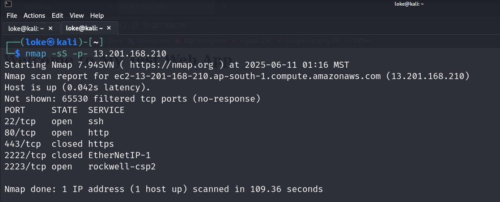
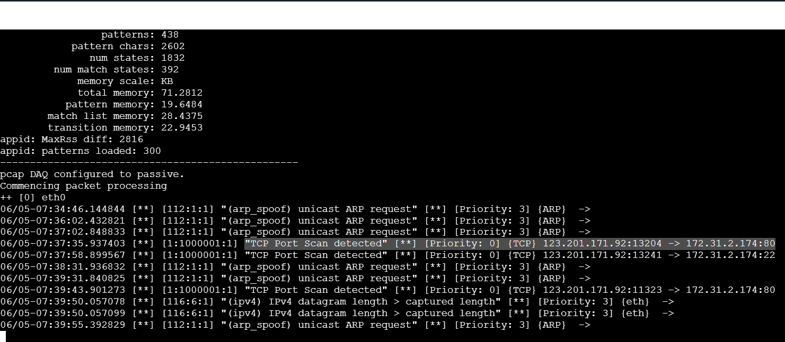
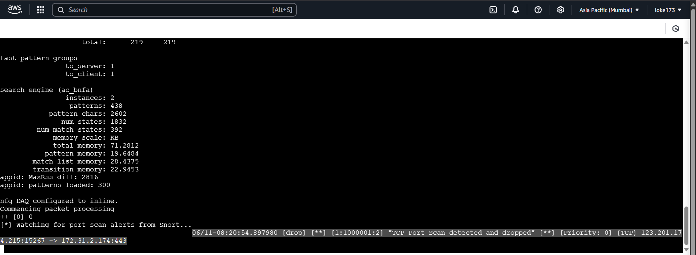
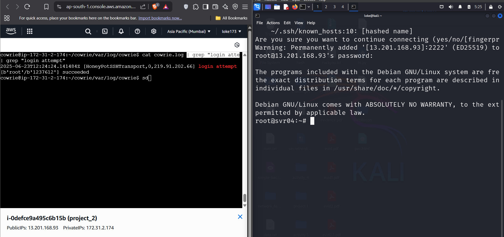

# Snort-Cowrie Intrusion Prevention & Deception Project

## 📌 Project Overview

This project demonstrates how to build a lightweight, effective Intrusion Prevention and Deception environment on a cloud-based Ubuntu EC2 instance. The core of the solution integrates **Snort** (in IPS mode) for real-time packet inspection and active blocking, and **Cowrie** for deception through an SSH honeypot.

The objective was to detect and block unauthorized activities (like port scans and brute-force SSH login attempts) while simultaneously luring attackers into a controlled honeypot environment for observation.

---

## 🎯 Objectives

- Deploy **Snort3** in both IDS and IPS modes to monitor and block malicious traffic.
- Deploy **Cowrie** honeypot on a decoy SSH port to observe attacker behavior.
- Tune **Snort rules** to apply thresholding for port scan and brute-force detection.
- Host a basic **Flask web app** and validate Snort’s behavior under different traffic scenarios.
- Automate deployment using a Bash script `auto.sh`.

---

## ⚙️ Setup & Implementation

### Phase 1: Infrastructure Setup

- Launched a **t2.medium EC2 instance** with Ubuntu 22.04 for performance.
- Installed and configured **Snort3** from source.
- Installed **Cowrie** and configured it to listen on port `2222`.
- Configured **iptables** to forward relevant traffic into `NFQUEUE` for Snort in IPS mode.

### Phase 2: Snort Deployment and Tuning

- Created custom **Snort rules** for:
  - Dropping port scans with threshold > 15 in 60 seconds.
  - Dropping SSH brute-force attempts with > 20 login attempts in 60 seconds.
  - Web app access rules were alert-only to avoid blocking legitimate traffic.
- Observed Snort misclassifying web traffic due to faulty thresholds. Solved it by tuning thresholds properly and refining rule logic.

### Phase 3: Cowrie Honeypot Deployment

- Set up Cowrie to mimic a real SSH service on port `2222`.
- Ensured this port was **excluded from NFQUEUE** in iptables so Snort wouldn’t interfere.
- Captured logs of attacker interaction with Cowrie via its default logging system.

### Phase 4: Automation

- Developed a Bash script `auto.sh` to:
  - Set up iptables
  - Start Snort in IPS mode
  - Start Cowrie
  - Reset everything gracefully on exit
- This drastically reduced reconfiguration time during testing and redeployment.

---

### Tools Used

- **Snort 3** (IPS)
- **Cowrie** (SSH Honeypot)
- **iptables** (NFQUEUE redirection)
- **tcpdump** (traffic monitoring)
- **nmap & hydra** (attack simulation)

---

## 🤖 Automation Script: `auto.sh`

This script automatically sets up Snort and Cowrie and tears everything down cleanly:

- Configures iptables to forward selected ports to NFQUEUE
- Launches Snort in IPS mode
- Launches Cowrie honeypot
- Stops services and resets iptables on termination

---

## 🔍 Rules Implemented

### Snort Detection Rules

| SID        | Description                         | Action | Threshold                  |
|------------|-------------------------------------|--------|----------------------------|
| 1000001    | TCP Port Scan                       | drop   | 15 attempts in 60 seconds  |
| 1000002    | SSH Brute Force on port 2223        | drop   | 20 attempts in 60 seconds  |
| 1000003+   | Web app attack patterns (e.g. SQLi) | alert  | Custom thresholds per rule |

---

## 🧪 Attack Simulations

### Port Scan
- Performed using `nmap`
- Snort blocked after threshold breach

### SSH Brute Force
- Hosted SSH on port `2223` to isolate testing
- Used `hydra` for brute-force attempts
- Snort detected & dropped after 20 failed attempts

### Honeypot Testing
- Attacked Cowrie via SSH on port `2222`
- Recorded attacker commands and session metadata

---

## 🖼️ Screenshots

| Description                          | Screenshot |
|--------------------------------------|------------|
| 🔍 Port scan *before* Snort deployed |  |
| 🧠 Snort in *IDS* mode                |  |
| 🛡️ Snort *detecting & blocking* scan |  |
| 🎯 Cowrie honeypot triggered         |  |

> _Note: Replace image paths if needed._

---

## ⚔️ Challenges & Solutions

| Challenge | Solution |
|----------|----------|
| Snort blocking legitimate traffic | Tuned event filters and refined thresholds |
| Port 2222 blocked by Snort        | Adjusted `iptables` and Snort bindings to exclude Cowrie |
| SSH self-detection issue          | Used secondary SSH port (`2223`) to simulate attacks safely |
| Thresholds not triggering         | Verified `event_filter` in `snort.lua` instead of using unsupported `threshold` keyword in `.rules` |

---

## ✅ Results

- Real-time attack detection and automated blocking using Snort IPS
- Successful honeypot deployment that logs attacker behavior
- Demonstrated resilience by simulating real-world scanning and brute-force attacks
- Infrastructure-as-Code style automation with `auto.sh`

---

## ✅ Key Learnings

- Hands-on experience configuring **Snort IPS/IDS**
- Real-world application of **Linux iptables**, Snort rules, and thresholds
- Deploying and managing a **deception system (Cowrie)**
- Linux automation with **Bash scripting**

---

## 📂 Files Included

- `auto.sh` - Automation script to set up and tear down the environment
- `snort.lua` - Final Snort configuration file
- `local.rules` - Custom Snort rules used in this project
- Screenshots - Showing Snort alerts and Cowrie interactions

---

## 👤 Author

**Lokesh Lankalapalli**  
Graduate Student, IT Security  
Arizona State University  
CEH | eJPT | Security+    
LinkedIn: [www.linkedin.com/in/lokesh-lankalapalli-549a10232]
